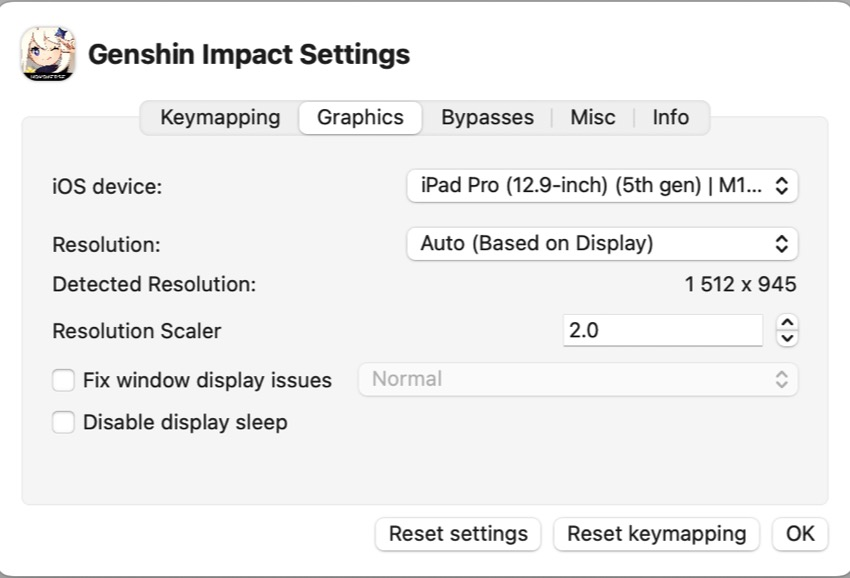
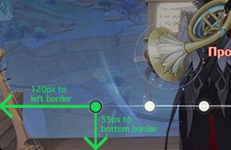
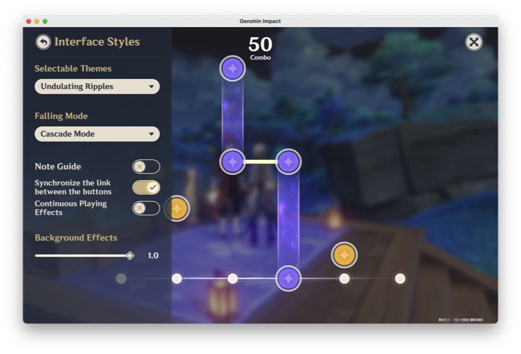
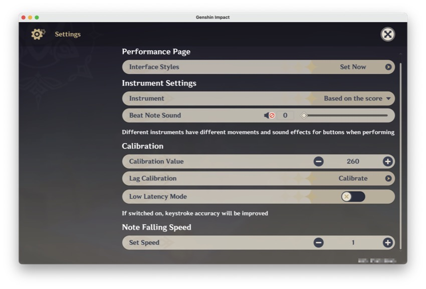

# Xtreme Carnival Ensemble Helper

Башҡа телдәрҙә: [English](README.md), [Русский](README.ru.md), **Башҡортса**

## Йөкмәткеһе
- [Xtreme Carnival Ensemble Helper](#xtreme-carnival-ensemble-helper)
  - [Йөкмәткеһе](#йөкмәткеһе)
  - [Демоһы](#демоһы)
  - [Тасуирламаһы](#тасуирламаһы)
  - [Шарттар](#шарттар)
  - [Mac OS-та ҡулланыу](#mac-os-та-ҡулланыу)
  - [Өҫтәмә мәҡәләләр](#өҫтәмә-мәҡәләләр)
  - [Рәхмәт](#рәхмәт)
  - [Лицензия](#лицензия)

## Демоһы

> [!CAUTION] 
> Проект тик белем биреү маҡсатында ғына булған! Уны үҙнеке ҡурҡыу һәм хәүеф ҡулланыу!

## Тасуирламаһы
Xtreme Carnival Ensemble Helper - ул ["Xtreme Carnival Ensemble"](https://genshin-impact.fandom.com/wiki/Iridescent_Arataki_Rockin%27_for_Life_Tour_de_Force_of_Awesomeness/Xtreme_Carnival_Ensemble) мини-уйынында уйынсыларға ярҙам күрһәтеү өсөн тәғәйенләнгән утилита "Грандиозное рок-турне "Многоцветье самой жизни в стиле Аратаки"" рок-турне квесы барышында. Скрипт OpenCV-ды уйын тәҙрәһен табыу һәм уйын процесын автоматлаштырыу өсөн файҙалана.

## Шарттар
- Python 3.8+
- OpenCV
- MacOS
- [Genshin Impact-ты PlayCover-та](https://playcover.io/)

## Mac OS-та ҡулланыу
1. Инанығыҙ, һеҙ системала Python версияһы 3.8 йәки унан юғарыраҡ ҡуйылған.
2. `pip install -r requirements.txt` ҡулланып.
3. Genshin Impact-ты в PlayCover-та асығыҙ.
4. Скрипт `main.py` үтәгеҙ.
5. Скрипт уйын тәҙрәһе аса һәм уйын автоматлаштырҙың процесы.

## Өҫтәмә мәҡәләләр
- Скрипт Mac OS менән эшләү өсөн генә! Windows, Linux эшләмәй!
- Мин төймәләрҙе үҙгәрттем, тик 1-6 генә ҡалдырҙым. Был папкала [PlayCoverKeymap.playmap](./PlayCoverKeymap.playmap) файлы бар, һеҙ уны ҡуллана алаһығыҙ. Тәүҙә настройкаһы һаҡлағыҙ!
  - 
- cv2.matchTemplate функцияһы 1512х945  үлсәмен ҡуллана. Әгәр үлсәмен башҡа булһа, тәҙрә үлсәмдәрен үҙгәртергә кәрәк.
  -  
  - 
- Уйын параметрҙары үзгәртергә кәрәк. Шунһыз matchTemplate эшләмәйәсәк.
  - 
  - 

## Рәхмәт
- `windowcapture.py` by [nopassport1](https://stackoverflow.com/questions/75620398/live-opencv-window-capture-screenshot-on-macos-darwin-using-python#answer-75629598)
- `keyboard.py` by [kenorb](https://github.com/kenorb/kenorb/blob/master/scripts/python/Quartz/keyboard.py)

## Лицензия
Был проект MIT лицензияһы буйынса лицензияланған, смекле мәғлүмәт алыу өсөн [LICENSE](LICENSE) файлын ҡарағыҙ.