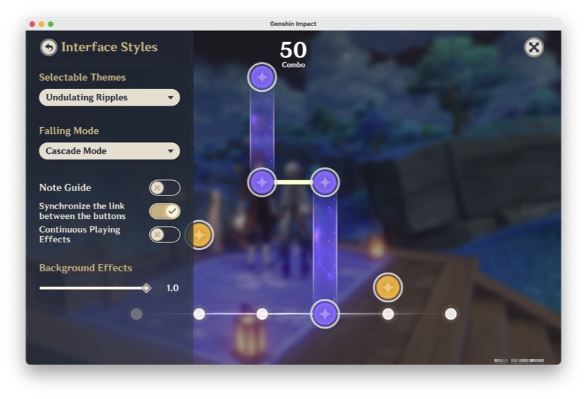
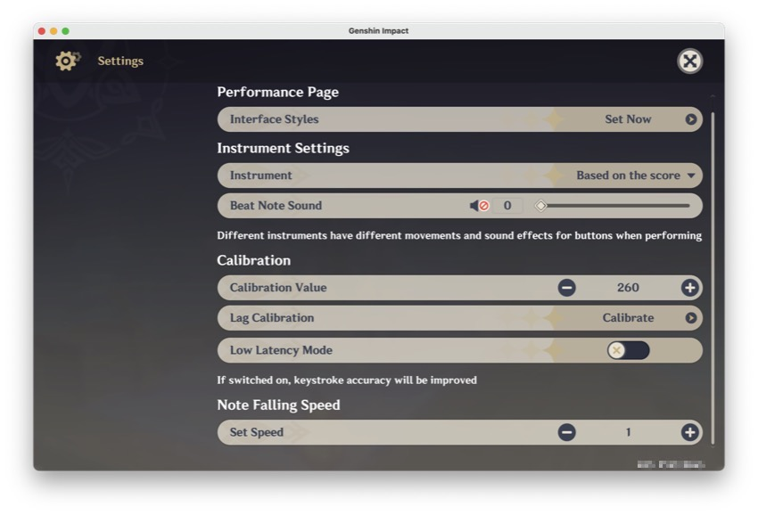

# Xtreme Carnival Ensemble Helper

In other languages: **English**, [Русский](README.ru.md), [Башҡортса](README.ba.md)

## Table of Contents
- [Xtreme Carnival Ensemble Helper](#xtreme-carnival-ensemble-helper)
  - [Table of Contents](#table-of-contents)
  - [Demo](#demo)
  - [Description](#description)
  - [Requirements](#requirements)
  - [Usage in MacOS](#usage-in-macos)
  - [Extra Notes](#extra-notes)
  - [Credits](#credits)
  - [License](#license)

## Demo

> [!CAUTION] 
> The project was made in education purpose only! Use it at your own risk!

## Description
The Xtreme Carnival Ensemble Helper is a utility designed to assist players in the mini-game ["Xtreme Carnival Ensemble"](https://genshin-impact.fandom.com/wiki/Iridescent_Arataki_Rockin%27_for_Life_Tour_de_Force_of_Awesomeness/Xtreme_Carnival_Ensemble) during the quest "Iridescent Arataki Rockin' for Life Tour de Force of Awesomeness." The script utilizes OpenCV to detect the game window and employs keyboard shortcuts to automate gameplay.

## Requirements
- Python 3.8+
- OpenCV
- MacOS
- [Genshin Impact in PlayCover](https://playcover.io/)

## Usage in MacOS
1. Ensure that Python 3.8 or higher is installed on your system.
2. Install the required dependencies using `pip install -r requirements.txt`.
3. Launch Genshin Impact within PlayCover.
4. Run the script `main.py`.
5. The script will detect the game window and automate gameplay as needed.

## Extra Notes
- The script is designed to work with macOS only! It will not work on Windows, Linux.
- I changed the keymapping of PlayCover, leaving only 1-6 keys. This folder contains the [PlayCoverKeymap.playmap](./PlayCoverKeymap.playmap) file and you can use it, but first save your config!
  - 
- The matchTemplate function based on static 1512x945 resolution, so you need to change the settings if you have a different resolution.
  -  
  - 
- You need to change the default settings inside the game.  Without this, matchTemplate will not work 
  - 
  - 

## Credits
- `windowcapture.py` by [nopassport1](https://stackoverflow.com/questions/75620398/live-opencv-window-capture-screenshot-on-macos-darwin-using-python#answer-75629598)
- `keyboard.py` by [kenorb](https://github.com/kenorb/kenorb/blob/master/scripts/python/Quartz/keyboard.py)

## License
This project is licensed under the [MIT License](LICENSE).
