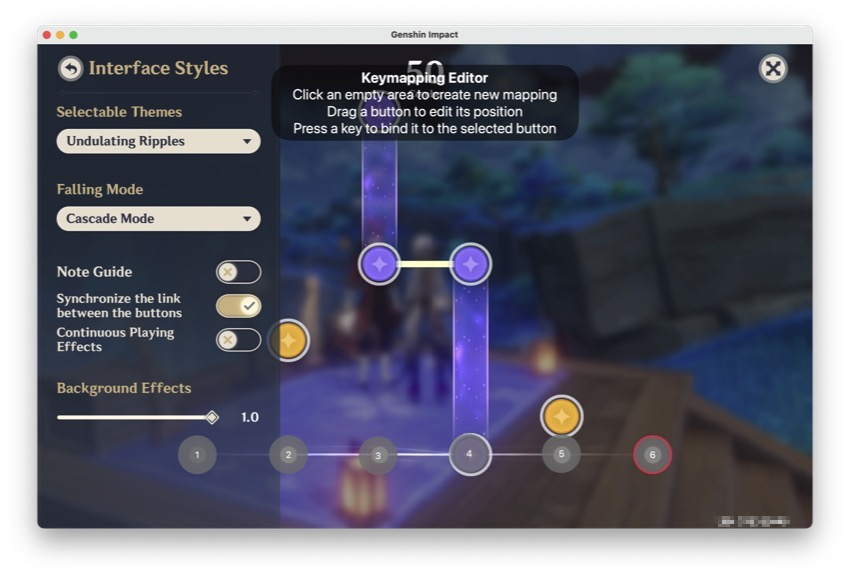
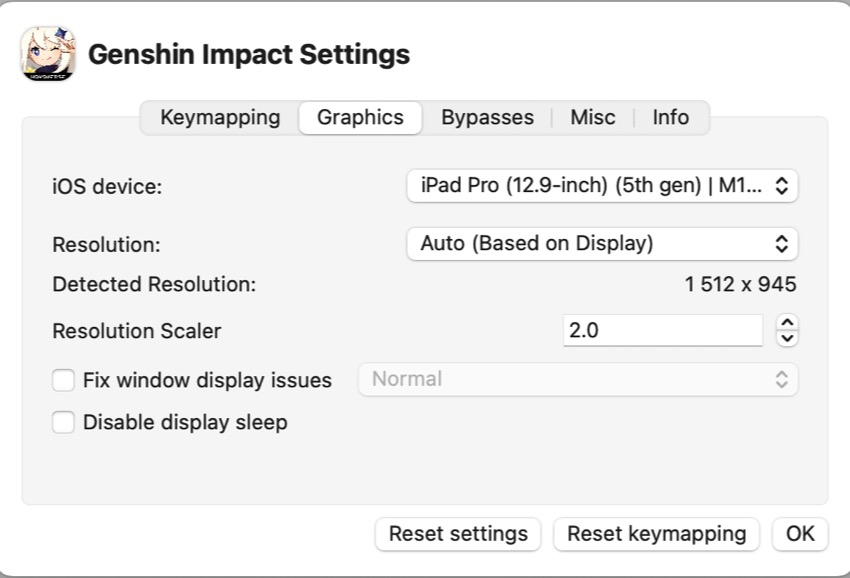
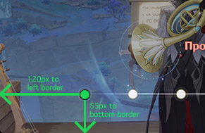

# Xtreme Carnival Ensemble Helper

На других языках: [English](README.md), **Русский**, [Башҡортса](README.ba.md)

## Таблица контента
- [Xtreme Carnival Ensemble Helper](#xtreme-carnival-ensemble-helper)
  - [Таблица контента](#таблица-контента)
  - [Демо](#демо)
  - [Описание](#описание)
  - [Требования](#требования)
  - [Использование в Mac OS](#использование-в-mac-os)
  - [Дополнительные заметки](#дополнительные-заметки)
  - [Благодарности](#благодарности)
  - [Лицензия](#лицензия)

## Демо

> [!CAUTION] 
> Проект создан исключительно в образовательных целях! Используйте его на свой страх и риск!

## Описание
Xtreme Carnival Ensemble хелпер - это утилита, предназначенная для оказания помощи игрокам в мини-игре ["Xtreme Carnival Ensemble"](https://genshin-impact.fandom.com/wiki/Iridescent_Arataki_Rockin%27_for_Life_Tour_de_Force_of_Awesomeness/Xtreme_Carnival_Ensemble) во время прохождения квеста "Грандиозное рок-турне "Многоцветье самой жизни в стиле Аратаки"". Скрипт использует OpenCV для обнаружения окна игры и использует клавиши для автоматизации игрового процесса.

## Требования
- Python 3.8+
- OpenCV
- MacOS
- [Genshin Impact в PlayCover](https://playcover.io/)

## Использование в Mac OS
1. Убедитесь, что в вашей системе установлен Python версии 3.8 или выше.
2. Установите необходимые зависимости, используя `pip install -r requirements.txt`.
3. Запустите Genshin Impact в PlayCover.
4. Запустите скрипт `main.py`.
5. Скрипт обнаружит игровое окно и автоматизирует игровой процесс по мере необходимости. 

## Дополнительные заметки
- Скрипт предназначен для работы только с MacOS! Он не будет работать на Windows, Linux.
- Я изменил кеймап клавиш в PlayCover, оставив только 1-6 клавиш. В этой папке находится файл [PlayCoverKeymap.playmap](./PlayCoverKeymap.playmap) вы можете его использовать, но прежде всего сохраните свой конфиг!
  - 
- Функция matchTemplate базируется на статическом разрешении 1512x945, поэтому вам нужно настроить размеры окна, если у вас другое разрешение.
  -  
  - 
- Вам необходимо изменить настройки по умолчанию в игре.  Без этого matchTemplate работать не будет.
  - 
  - 

## Благодарности
- `windowcapture.py` by [nopassport1](https://stackoverflow.com/questions/75620398/live-opencv-window-capture-screenshot-on-macos-darwin-using-python#answer-75629598)
- `keyboard.py` by [kenorb](https://github.com/kenorb/kenorb/blob/master/scripts/python/Quartz/keyboard.py)

## Лицензия
Этот проект лицензирован по лицензии MIT - см. файл [LICENSE](LICENSE) для получения подробной информации.
